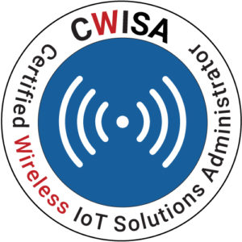

# CWISA – Certified Wireless IoT Solutions Administrator – Exam Experience

05-26-2021

I started my CWISA studies in March 2021, my goal was to obtain the CWISA cert before moving to another State for my new role in Cisco, it took almost 3 months to prepare and pass the exam, starting from 3-3 to 5-24.

I planed to study for this certification at least 3 hours after work, and 6 – 8 hours in only one day of the weekends, sometimes I had to recalculate and adjust due to incoming situations (family, job interviews, work).

## What’s CWISA?

The CWISA certification is a professional-level wireless certification for the CWNP Program.

CWISA is built upon two decades of historic quality in WLAN (802.11) certifications and begins the extension of CWNP offerings into the non-802.11 wireless solutions:

- Internet of Things (IoT)
- Bluetooth Low Energy (BLE)
- Cellular Solutions (LTE, LTE-U, 5G, CBRS)
- Machine to Machine Communications (M2M)
- Zigbee
- Location Services
- Wired-Side Supporting Technologies
- High-Level Awareness of APIs and Automation/Integration Concepts
- Project and Program Management Specific to Wireless Solutions Projects

## What it takes to become a CWISA certified

### Understand:

- Wireless Technologies
- Radio Frequency Communications
- Planning Wireless Solutions
- Implementing Wireless Solutions
- Supporting Wireless Solutions

### Exam objectives:

You can find the complete list of objectives at the following [link.](https://www.cwnp.com/uploads/cwsa-101-objectives-2019.pdf)

### Exam requirements:

- Exam Number: CWISA-101
- Availability: [Pearson Vue Testing Center](https://home.pearsonvue.com/ 'Pearson Vue')
- Duration: 90 minutes
- Questions: 60 single choice
- Language: English
- Passing Score: 70

## CWISA preparation materials

The official materials from [CWDP](https://www.cwnp.com/) were the only resources that I used.

I read the [CWISA-101 Official Study Guide,](https://www.cwnp.com/cwsa101sg/) and I took the [CWISA-101 Practice Test](https://www.cwnp.com/cwsapt/) after reading the book.

## Exam day

05-24-21

I had some issues at Testing Center, the proctor had to call Pearson Vue support because my exam wasn’t available to take, I started 45 minutes after my original time scheduled, the questions are well-formulated, many tricky questions that you spend a couple of minutes analyzing the answers.

Only single choice questions, there are no simulation labs on the exam, very important you have the option to go back after answering any question, and before ending the exam, there is a button to review the unanswered questions.

I finished it in one hour.

## Results

My score was 88/100, I know… It’s not a perfect score, and there is a lot of room for improvement, but I’m still learning.

Having a [CWNA](https://www.dar-fi.com/blog-i-passed-my-cwna-test/) and [CWDP](https://www.dar-fi.com/cwdp-exam-experience/) prior to this certification is a big plus, the first 5 chapters are a recap of those tracks.

My worn suggestion is to take notes while reading and print those concepts in your memory, and at the end of the chapter go back and re-read those notes.

Every time that I’m learning a new technology or protocol, I try to explain it to my wife, a friend, a coworker using my own words, and I can memorize and grasp better the concepts, that’s my approach.

As always, I hope that my short experience can answer any doubt during your CWISA journey, the COVID-19 is still a thing, but now the people are getting vaccinations, hoping this nightmare ends soon.
