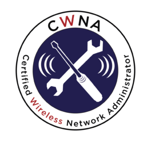

# I passed my CWNA test in the first attempt!

02-07-2020

This is a peculiar year where working from home is trending, and working in the office is dangerous because of “COVID-19”. We made some friends, we lost some friends, we miss a lot of friends, and we have learned/developed new skills in these times of crisis.

The CWNA exam measures your understanding of the fundamentals of RF behavior, your ability to describe the features and functions of wireless LAN components, and your knowledge of the skills needed to install, configure, and troubleshoot wireless LAN hardware peripherals and protocols

_“Coleman, D. D., & Westcott, D. A. (2018). CWNA Certified Wireless Network Administrator study guide. Hoboken, NJ: Sybex, a Wiley Brand, page 51″_

I know… there are a lot of blogs talking & teaching how to prepare and pass the Certified Wireless Network Administrator CWNA test, I’m not pretending to overcome those well-structured blogs, I just want to share; how I prepared myself to take and pass the test in 5 months, yes I know, I know… potentially many fellas passed it in a lower timeframe, but raising a child + working from home + studying  = sometimes is overwhelming.

I started this journey in February 2020. I’ve decided to study to pass my CWNA test only to get a new certification, I used the following references and materials:

- CWNA: Certified Wireless Network Administrator Official Study Guide, First Edition, Book, by Tom Carpenter. [Bookstore](https://www.cwnp.com/cwna107sg/)
- CWNA Certified Wireless Network Administrator Study Guide, 5th Edition by David D Coleman, David A Westcott. [Bookstore](https://www.wiley.com/en-us/CWNA+Certified+Wireless+Network+Administrator+Study+Guide%3A+Exam+CWNA+107%2C+5th+Edition-p-9781119425786)
- Wireshark for Wireless LANs by Jerome Henry / James Garringer live lessons. (Highly Recommended).  [Bookstore](https://www.oreilly.com/library/view/wireshark-for-wireless/9780134767529/)
- The well known open-source packet analyzer “Wireshark” [Download Wireshark](https://www.wireshark.org/#download)
- Personal note pad.

The short answer that you’re looking for; “CWNA: Certified Wireless Network Administrator Official Study Guide, First Edition Book” it’s all of you need to pass the test, that’s it, my point of view regarding that guide, it’s a limited text that only focused in the scope “pass the exam”.

Now, if you are curious, and you really want to learn 802.11 wireless LAN out of the test scope (like me) I would suggest you try: CWNA Certified Wireless Network Administrator Study Guide, 5th Edition Book. It’s a good text, it doubled in size the Official Study Guide, it has useful analogies and examples that make it easier to grasp the concepts, the methodology is good when you purchase the book it comes with access to a very useful test environment, and it provides you access to download .pcap files to see what a beacon frame looks like.

Also, I encouraged you to take a look into “Wireshark for Wireless LANs by Jerome Henry / James Garringer live lessons at O’Reilly [webpage](https://www.oreilly.com/library/view/wireshark-for-wireless/9780134767529/)” there are almost 8 hours of comprehension lessons teaching you wireless principles using Wireshark,  Jerome & James will guide you starting from basic to complex concepts, also they will teach you how to troubleshoot efficiently an 802.11 wireless LAN, my approach with the lessons was capturing packets in the air at home, some wireless controllers and access points have built-in to take packets capture in wireless monitor mode, of course, you can use a laptop or desktop with a wireless LAN card to take packets captures, after every lesson, I replicated the same scenarios, and I tried to analyze what’s going on at home, I discovered issues, vulnerabilities and I made some improvement in my own wireless connection.

**A very worn & generic term** is to take notes, take notes after a tough explanation, take note after every chapter, what you learned? mention the topics discussed, type the acronyms with and without the meanings *“Friends, I swear from the beginning of the paragraphs until the end you will see acronyms everywhere”* write and memorize those are important because in the exam they could question using the complete name or just the shortcut ?

My last piece of advice is… when you have completed the 80% of the book, go and schedule your exam, give you a month or maybe two months to take the test, it will speed up your pace, it will keep you focused in the incoming test, and it will avoid that you procrastinate your studies, some research confirms that we perform better when we are close to the deadline, well, that defined me in 70% ?

I admit that I began my CWNA studies just to obtain the certificate, ignoring that I’d find my true passion in networking systems “Wireless Technology” I passed the test with 83% with true knowledge.

Every day, after reading some fragments I was curious, I wanted to learn more and more, see how the radio frequency travels, how the modulation is built, learn that a simple deployment is a challenge and it could be a nightmare without planning, know that every wireless component has an important role to play in a service set, there is a minimum margin for error, meaning that’s not a light task and requires careful planning.

I hope that my short story and experience helps you in some way in this wonderful World, leave me a message if you have any question, and I’d be glad to help you.

> Note: 
> CWNP published **The updated CWNA-108 study guide will be available in September 2020**

Probably they will release a new test including deeper topics about 802.11ax or Wi-Fi 6, getting deeper in high-density environments planning, wireless operation with IoT devices, and many other things, let’s see what CWNA has prepared for us.
